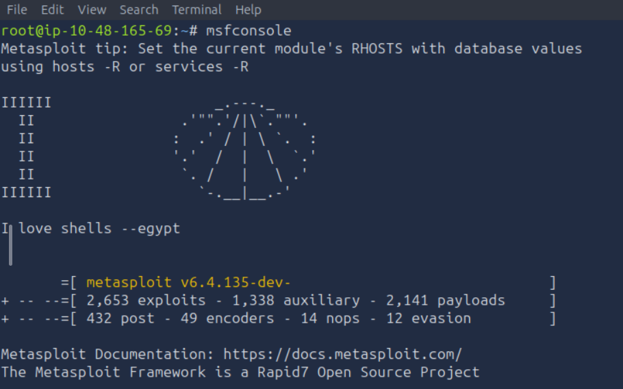
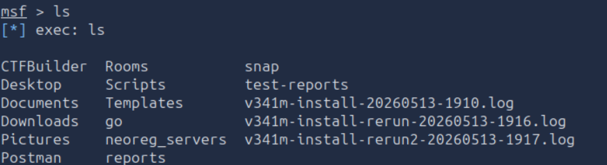
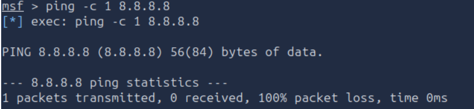
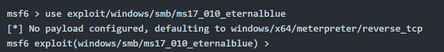
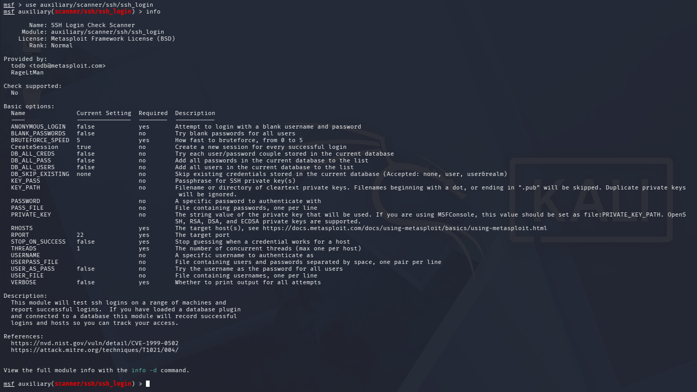

**METASPLOIT: INTRODUCTION \- TRYHACKME WRITEUP**

**General Overview**

Metasploit is a popular and widely used exploitation framework. It is used by security professionals for vulnerability assessment, penetration testing and post-exploitation activities.

**Learning Objectives**

By completing this room, I learned:

* What Metasploit Framework is and its purpose in ethical hacking.  
* The architecture and main components of Metasploit.  
* How to navigate the `msfconsole` interface.  
* How to search, select, configure, and execute modules.  
* Basic exploitation workflow using Metasploit.

Metasploit has two main versions: *Metasploit Pro* & *Metasploit Framework*. In this room, we will be learning the latter one.

**Starting the Metasploit Framework**

The Metasploit Framework can be launched using:

`msfconsole`

This opens the Metasploit command-line interface where modules can be searched and executed.

**Main Modules Of Metasploit Framework**

**Exploit** – Used to take advantage of vulnerabilities in a target system.  
**Payload Modules** – Code executed on the target after successful exploitation.  
**Auxiliary Modules** – Used for tasks like scanning, enumeration, and fuzzing.  
**Post-Exploitation Modules** – Used after gaining access to gather information or maintain access.

**Some Components:**  
Auxiliary, Encoders, Payloads, Exploits, Evasion, NOPs, Post

**MSFCONSOLE**

1. The first command that we will use is ls to find out the list of directories present. 

2. Next we will `ping` the Google DNS IP(8.8.8.8). Since we are operating through AttackBox(Linux), we need to add `-c 1` so that only one ping is sent. Otherwise, the ping process would continue and we would have to use CTRL+C to stop it.  
     
3. Using `ms17_010_eternalblue` exploit   
     
   The **MS17-010 EternalBlue exploit** is a famous exploit that targets a critical vulnerability in Microsoft's **Server Message Block (SMB) v1 protocol** on Windows systems.   
     
   **What does MS17-010 mean?**  
* **MS** → Microsoft Security Bulletin  
* **17** → The year the security update was released (2017)  
* **010** → The bulletin number

**What is EternalBlue?**

EternalBlue is an exploit developed by the **National Security Agency (NSA)** and later leaked publicly by a group called the **The Shadow Brokers** in 2017\. It  is famous because it was used in WannaCry ransomware attack in 2017\. 

**SMB:** A network communication protocol used for sharing files and resources over the network.

  
Here, various commands can be used such as `show options, show payloads, info` for more detailed information, `search` for conducting searches for various exploit names, target systems, etc. 

4. **Who provided the auxiliary/scanner/ssh/ssh\_login module?**   
   We can find this by writing the command `use auxiliary/scanner/ssh/ssh_login` inside msfconsole. Next, we will find out its detailed information by using info.  
    
   We can see that it is provided by **todb**.  
     
5. **Setting parameters:**  
   As you can see in the show options screenshot above, some of these parameters require a value for the exploit to work. 

RHOSTS parameter can be set by :  
*set rhosts \[target ip\]*  
Use ***setg*** instead of set to set for all modules instead of just one. It is a global value.

6. `Exploit` command is used to proceed with the exploitation phase.

## **Tools Used**

* Metasploit Framework (`msfconsole`)  
* TryHackMe AttackBox / Kali Linux

## **Skills Developed**

* Vulnerability assessment basics  
* Metasploit navigation  
* Exploit configuration  
* Command-line proficiency  
* Understanding penetration testing workflow

