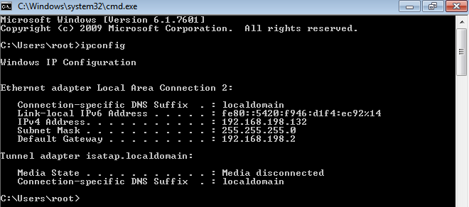
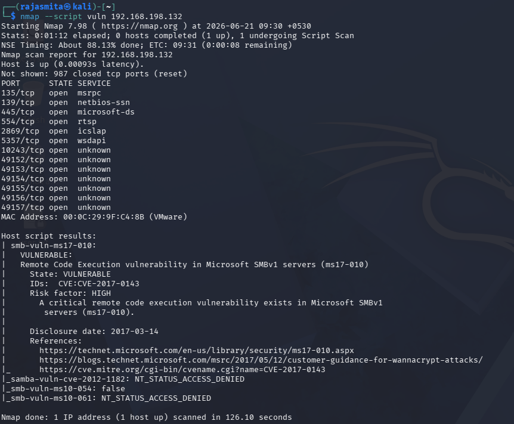
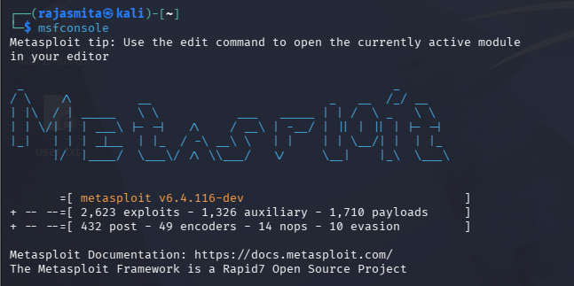
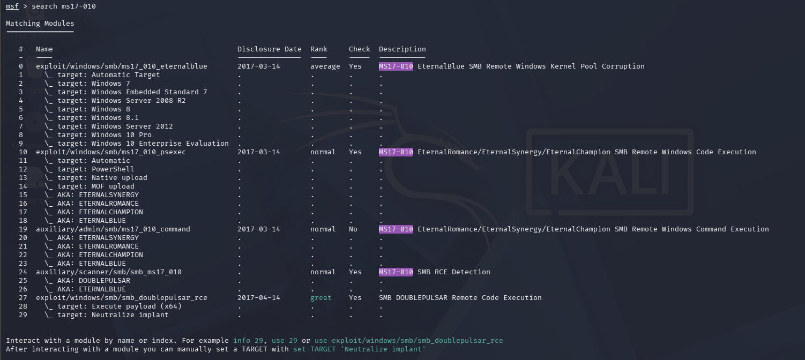
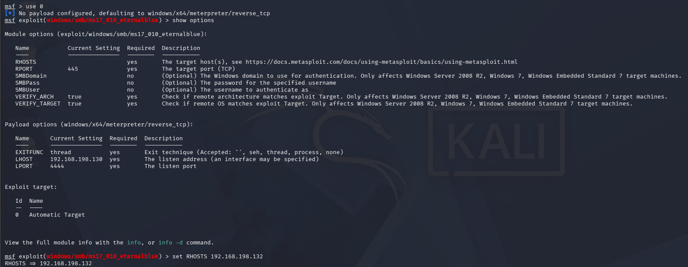
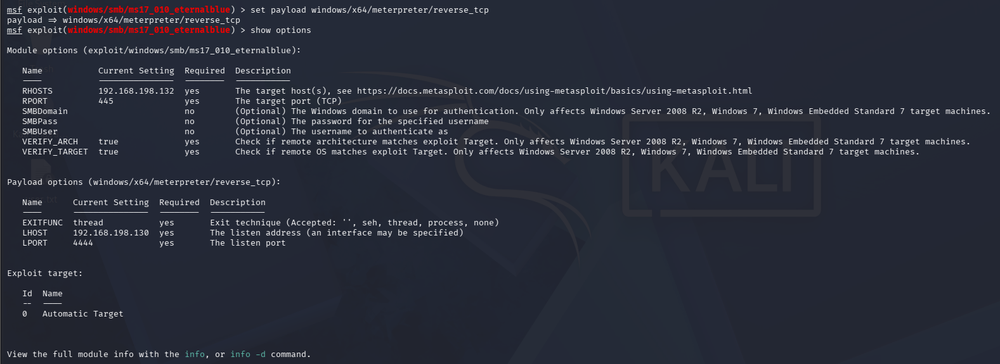
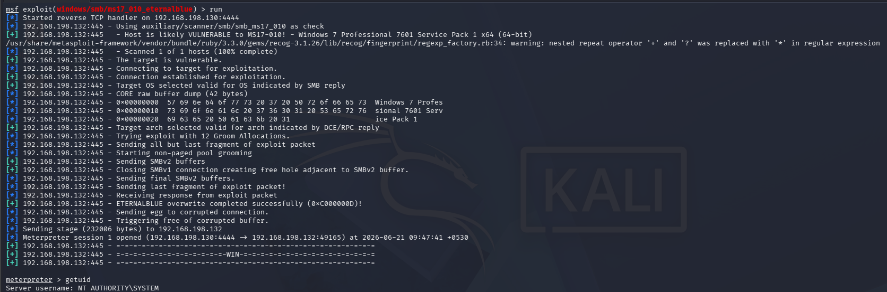
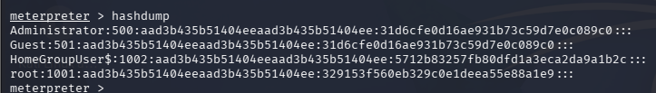
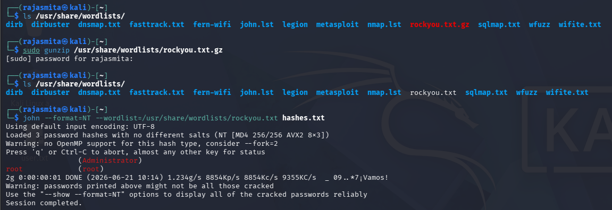
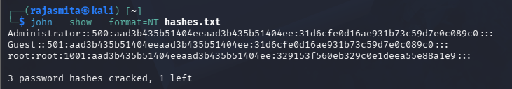

[WINDOWS 7 EXPLOITATION.md](https://github.com/user-attachments/files/29171853/WINDOWS.7.EXPLOITATION.md)
**WINDOWS 7 EXPLOITATION**

Step 1: Find out the IP of target machine(Win 7\)

Step 2: Perform a nmap scan to find out vulnerabilities

**Vulnerability in Microsoft SMBv1 servers (ms17-010)** 

Step 3: Start metasploit

Step 4: After setting the LHOST and RHOSTS, to run the exploitation we need to set payload.

Step 5: Exploit/run

**SYSTEM-level access on Windows 7 has been gained.**

Step 6: View the password hashes stored in the Windows database using **hashdump**

Step 7: Try to recover the password using **John the Ripper** 

